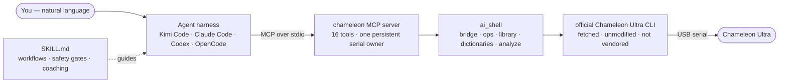

<div align="center">

# Rango

**Chameleon Ultra AI Copilot** — read, crack, dump, analyze, emulate and clone
RFID cards through natural language, with safety gates and a host-side card library.

[](https://github.com/fedroraddict/rango/actions/workflows/ci.yml)
[](LICENSE)
[](pyproject.toml)
[](https://modelcontextprotocol.io)
[](adapters/README.md)

[Prerequisites](#prerequisites) · [Quick start](#quick-start) · [Other harnesses](#use-from-codex-claude-code-opencode) · [MCP tools](#mcp-tools-16) · [Coverage](#card-coverage) · [Development](#development)


<sub>Chameleon Ultra — image © [RfidResearchGroup](https://github.com/RfidResearchGroup/ChameleonUltra)</sub>

</div>

Rango turns a [Chameleon Ultra](https://github.com/RfidResearchGroup/ChameleonUltra)
into an agent-driven RFID copilot. It is **only** the AI layer: the official Chameleon
Ultra CLI is *not* vendored into this repo — clone it separately; Rango locates and
drives it in-process (see [Prerequisites](#prerequisites)).

Two ways to use it:

1. **Kimi Code plugin** (best experience) — an MCP server + skill + analysis subagent;
   the [Kimi Code](https://www.kimi.com/code) agent operates the device for you.
2. **Standalone AI shell** — an enhanced REPL around the stock CLI where `?` talks to
   an LLM (Moonshot/Kimi API or any OpenAI-compatible endpoint).

## Architecture



## Prerequisites

```bash
git clone https://github.com/fedroraddict/rango rango && cd rango

scripts/install-cli.sh   # fetches the stock upstream CLI into ../ChameleonUltra
                         # (git clone, with a codeload tarball fallback when
                         #  github.com is unreachable)
uv sync
scripts/setup-plugin.sh  # writes plugin/.rango-root so the MCP launcher still
                         # finds this repo after /plugins install copies plugin/
```

The installer is idempotent and prints what it did. If you keep the upstream checkout
somewhere else, pass the path (`scripts/install-cli.sh /path/to/ChameleonUltra`) and set
`export CHAMELEON_SOFTWARE=/path/to/ChameleonUltra/software`.

Requires Python ≥ 3.10, [uv](https://docs.astral.sh/uv/), and the device on a
data-capable USB-C cable.

## Quick start

```bash
# Standalone AI shell (stock CLI commands pass through; '? ...' asks the AI)
cd rango && uv run python -m ai_shell
#   needs MOONSHOT_API_KEY (or another OpenAI-compatible endpoint in
#   ~/.chameleon_ai/config.toml) for AI features; plain CLI works without it

# Kimi Code plugin
#   in Kimi Code: /plugins install <this-repo>/plugin   then  /reload
```

## Use from Codex, Claude Code, OpenCode

The MCP server is a standard stdio server — not Kimi-only. Per-harness config snippets
and install notes live in [adapters/](adapters/README.md): Claude Code (`.mcp.json` /
`claude mcp add` + drop-in skill and agent), Codex CLI (`[mcp_servers.chameleon]` +
skill with stripped frontmatter), OpenCode (`opencode.json` + converted agent file).

## MCP tools (16)

| Tool | Purpose |
|---|---|
| `chameleon_run` | Execute any official CLI command. Read-only runs directly; writes/attacks require `confirm_dangerous=true` after user approval |
| `chameleon_state` | One-call snapshot: firmware, battery, active slot, per-slot summary — the pre-flight check |
| `chameleon_help` / `chameleon_catalog` | Exact syntax of one command / the full command tree |
| `card_list` / `card_add` / `card_show` / `card_remove` | Host card library (`~/.chameleon_ai/cards/`) — unlimited named dumps, independent of the 8 device slots |
| `card_load` | Composite: library card → free device slot, verified order (type → eload → block0 → enable → nick), auto free-slot pick |
| `card_analyze` | Offline dump analysis (raw `.bin` or Flipper `.nfc`): access-bits decode, key audit with known-system fingerprints, value blocks, MAD/NDEF, card-type ID |
| `dict_list` / `dict_seed_default` / `dict_create` / `dict_merge` / `dict_import` / `dict_show` | Mifare key dictionaries (`~/.chameleon_ai/dicts/`); `dict_show` feeds keys positionally to `hf mf fchk` |

## What the copilot layer adds

- **Pre-flight ritual** — workflows start with `chameleon_state`; gated steps are announced first.
- **Detection coaching** — failed scans trigger placement guidance, HF/LF alternation, app cross-check — not silent retry loops.
- **Key-recovery decision tree** — default dictionary → targeted dictionary built from a web search of the card system's known keys → `hf mf autopwn` → manual PRNG attacks (darkside / nested / senested / hardnested, with expected durations) → last resort: mfkey32v2 reader-side recovery (`hf mf elog --decrypt`).
- **Library-first model** (mirrors the CU GUI's Saved Cards): dumps get user-chosen names in the library; slots are working memory.
- **Slot discipline** — list first, prefer free slots, ask before overwriting, always name, always enable (`(disabled)` slots don't emulate), persist with `hw slot store`.
- **Collaboration modes** — *copilot* (confirm each gated step) or *autopilot* (approve a stated workflow once). `hw dfu`, `hw factory_reset`, and physical-card writes always get their own confirmation.
- **Offline analysis subagent** (`card-analyst`) for deep dump inspection.

## Card coverage

| Band | Families |
|---|---|
| **HF** | Mifare Classic (full attack suite) · Ultralight/NTAG (incl. `ulcg` backdoor, UL-C authnonce) · DESFire (`hf des chk`) · SEOS · EMV payment · generic ISO14443-A sniff/auth-trace |
| **LF** | EM410x · EM4x05 · HID Prox · ioProx · PAC/Stanley · Viking · Jablotron · IDTECK · T5577 writing · raw `lf sniff` + offline analysis for unknown families |

## Known quirks (verified on hardware)

- `hf mf fchk --dic` is a no-op stub in some upstream builds — pass keys positionally (`dict_show` exists for this).
- Serial desync (frame-error flood / connect timeout) happens if the process holding the port is killed mid-connection — unplug/replug the device; `hw disconnect` before reloading the plugin.
- A slot that starts as `(disabled)undef` must be `hw slot enable`d after loading or it won't emulate.
- The CLI tokenizes with a plain whitespace split — never quote arguments (`hw slot nick ... -n bike`, not `-n "bike"`, or the quotes become part of the nick) and keep paths space-free.

## Development

```bash
cd rango
uv run ruff check ai_shell/ plugin/mcp/          # lint
uv run python -m ai_shell.selfcheck            # cited commands exist in the real CLI tree,
                                               # gate semantics, simulated /plugins install boot
uv run python -m ai_shell.test_analyze         # dump-analyzer regression tests
```

CI runs the same three gates on every push and PR (see
[.github/workflows/ci.yml](.github/workflows/ci.yml)).

Layout: `ai_shell/` wrapper library · `plugin/` Kimi Code plugin
(see [plugin/README.md](plugin/README.md)) · `scripts/` upstream-CLI installer + plugin
setup · `adapters/` other-harness configs (see [adapters/README.md](adapters/README.md))
· `AGENTS.md` contributor/agent notes.

## Credits

Everything device-side — the Chameleon Ultra firmware and the official CLI that Rango
drives — comes from
[RfidResearchGroup/ChameleonUltra](https://github.com/RfidResearchGroup/ChameleonUltra),
© its authors (see its `AUTHORS.md`). Rango is only the AI copilot layer on top: it
contains no upstream code, and the CLI is fetched by `scripts/install-cli.sh` and used
unmodified.

Also standing on:

- the [Proxmark3 community](https://github.com/RfidResearchGroup/proxmark3) — known-key
  and MAD AID conventions (`mad.json` can be dropped into `~/.chameleon_ai/dicts/`);
- NXP's MF1S50YYX datasheet — the access-bits and value-block decode tables in
  `ai_shell/analyze.py` follow it;
- the [Model Context Protocol](https://modelcontextprotocol.io) — the interface every
  supported agent harness speaks;
- [Kimi Code](https://www.kimi.com/code) — the plugin format and the default LLM
  endpoint for the standalone shell.

## License & responsible use

Rango itself is [MIT](LICENSE). The upstream Chameleon Ultra CLI is a separate project
under GPL-3.0 — fetched, not vendored — so its license governs the CLI, not this repo.
Operate only on cards and devices you own or are explicitly authorized to test.
